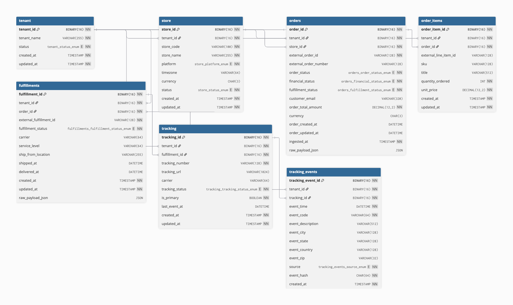

# FenixCommerce: Multi-Tenant Commerce Ingestion Service

## Entity Relationship Diagram

## Relationship Matrix

| Parent | Child | Cardinality | Constraint | Delete Policy |
|--------|-------|-------------|-----------|---------------|
| TENANT | STORE | 1:N | UNIQUE(tenant_id, store_code) | RESTRICT |
| TENANT | ORDERS | 1:N | UNIQUE(tenant_id, store_id, external_order_id) | RESTRICT |
| TENANT | ORDER_ITEMS | 1:N | UNIQUE(tenant_id, order_id, external_line_item_id) | RESTRICT |
| TENANT | FULFILLMENTS | 1:N | UNIQUE(tenant_id, order_id, external_fulfillment_id) | RESTRICT |
| TENANT | TRACKING | 1:N | UNIQUE(tenant_id, tracking_number) | RESTRICT |
| TENANT | TRACKING_EVENTS | 1:N | UNIQUE(tenant_id, event_hash) | RESTRICT |
| STORE | ORDERS | 1:N | FK store_id | RESTRICT |
| ORDERS | ORDER_ITEMS | 1:N | FK order_id | CASCADE |
| ORDERS | FULFILLMENTS | 1:N | FK order_id | CASCADE |
| FULFILLMENTS | TRACKING | 1:N | FK fulfillment_id | CASCADE |
| TRACKING | TRACKING_EVENTS | 1:N | FK tracking_id | CASCADE |

## Table Descriptions

### TENANT

Root entity for multi-tenancy. All other entities are scoped to a tenant.

- **Primary Key**: `tenant_id` (BINARY(16), UUID)
- **Unique**: `tenant_name`
- **Status**: ACTIVE | INACTIVE

### STORE

Represents a website/storefront per tenant (e.g., Shopify store, NetSuite site).

- **Primary Key**: `store_id` (BINARY(16), UUID)
- **Foreign Keys**: `tenant_id`
- **Composite Unique**: `(tenant_id, store_code)` — natural key per tenant
- **Platforms**: SHOPIFY, NETSUITE, CUSTOM, MAGENTO, OTHER
- **Constraints**: Currency must match `[A-Z]{3}` (ISO 4217)

### ORDERS

Customer orders from external systems, upserted by natural key.

- **Primary Key**: `order_id` (BINARY(16), UUID)
- **Foreign Keys**: `tenant_id`, `store_id`
- **Composite Unique**: `(tenant_id, store_id, external_order_id)` — natural key for upsert
- **Statuses**:
  - `order_status`: CREATED | CANCELLED | CLOSED
  - `financial_status`: UNKNOWN | PENDING | PAID | PARTIALLY_PAID | REFUNDED | PARTIALLY_REFUNDED | VOIDED
  - `fulfillment_status`: UNFULFILLED | PARTIAL | FULFILLED | CANCELLED | UNKNOWN
- **Constraints**: `order_total_amount >= 0`, currency pattern, ISO date-time fields
- **Indexes**: For date-range queries and search filters

### ORDER_ITEMS

Line items within an order (optional but recommended).

- **Primary Key**: `order_item_id` (BINARY(16), UUID)
- **Foreign Keys**: `tenant_id`, `order_id`
- **Composite Unique**: `(tenant_id, order_id, external_line_item_id)` — natural key per order
- **Constraints**: `quantity_ordered >= 0`, `unit_price >= 0`
- **Cascade Delete**: Deleted with parent order

### FULFILLMENTS

Shipment fulfillment records, one per external fulfillment ID.

- **Primary Key**: `fulfillment_id` (BINARY(16), UUID)
- **Foreign Keys**: `tenant_id`, `order_id`
- **Composite Unique**: `(tenant_id, order_id, external_fulfillment_id)` — natural key per order
- **Status**: CREATED | SHIPPED | DELIVERED | CANCELLED | FAILED | UNKNOWN
- **Constraint**: `delivered_at >= shipped_at` (temporal ordering)
- **Cascade Delete**: Deleted with parent order

### TRACKING

Tracking numbers per fulfillment (can have multiple per fulfillment).

- **Primary Key**: `tracking_id` (BINARY(16), UUID)
- **Foreign Keys**: `tenant_id`, `fulfillment_id`
- **Composite Unique**: `(tenant_id, tracking_number)` — unique per tenant
- **Status**: LABEL_CREATED | IN_TRANSIT | OUT_FOR_DELIVERY | DELIVERED | EXCEPTION | UNKNOWN
- **Cascade Delete**: Deleted with parent fulfillment

### TRACKING_EVENTS

Immutable event log per tracking number (idempotent via `event_hash`).

- **Primary Key**: `tracking_event_id` (BINARY(16), UUID)
- **Foreign Keys**: `tenant_id`, `tracking_id`
- **Composite Unique**: `(tenant_id, event_hash)` — idempotency via SHA-256 hash
- **Source**: CARRIER | SHOPIFY | FENIX | OTHER
- **Cascade Delete**: Deleted with parent tracking
- **Read-Only**: Never updated, only inserted; duplicates are silently ignored

## Key Design Patterns

### Multi-Tenancy

- Every table has `tenant_id` as part of composite keys and indexes
- All foreign keys to parent tenants use `ON DELETE RESTRICT` to prevent orphaning
- Ensures complete data isolation and efficient tenant-scoped queries

### UUID Storage

- All UUIDs stored as `BINARY(16)` for efficiency (16 bytes vs 36 bytes as string)
- Conversion: `UUID_TO_BIN(uuid_str, 1)` on write, `BIN_TO_UUID(binary_col, 1)` on read
- APIs/DTOs use standard UUID string format (e.g., "f47ac10b-58cc-4372-a567-0e02b2c3d479")

### Upsert Semantics

- **Orders**: ON DUPLICATE KEY UPDATE using composite natural key `(tenant_id, store_id, external_order_id)`
- Merges incoming state, preserves earliest timestamps with COALESCE, uses GREATEST for updates
- After upsert, SELECT by natural key to retrieve internal `order_id`

### Idempotent Event Ingestion

- **Tracking Events**: SHA-256 `event_hash` prevents duplicate events
- ON DUPLICATE KEY UPDATE does nothing (silent idempotent insert)
- Post-insert, UPDATE tracking rollup fields (`last_event_at`, `tracking_status`)

### Cascade vs Restrict

- **Child entities** (ORDER_ITEMS, FULFILLMENTS, TRACKING, TRACKING_EVENTS): CASCADE delete
- **Tenant/Store rows**: RESTRICT prevents accidental orphaning of multi-tenant data

## Data Constraints & Validation

| Table | Constraint | Rule |
|-------|-----------|------|
| STORE | currency | `[A-Z]{3}` or NULL (ISO 4217) |
| ORDERS | order_total_amount | >= 0 |
| ORDERS | currency | `[A-Z]{3}` or NULL |
| ORDER_ITEMS | quantity_ordered | >= 0 |
| ORDER_ITEMS | unit_price | >= 0 |
| FULFILLMENTS | shipped/delivered | delivered_at >= shipped_at (if both present) |

## Indexes for Performance

| Table | Index | Columns | Purpose |
|-------|-------|---------|---------|
| STORE | idx_store_tenant | (tenant_id) | Tenant-scoped lookups |
| ORDERS | idx_orders_tenant_updated | (tenant_id, order_updated_at) | Date-range filters |
| ORDERS | idx_orders_store_updated | (store_id, order_updated_at) | Store-level reports |
| ORDERS | idx_orders_tenant_number | (tenant_id, external_order_number) | External number search |
| ORDER_ITEMS | idx_items_tenant_order | (tenant_id, order_id) | Line item lookups |
| ORDER_ITEMS | idx_items_sku | (tenant_id, sku) | SKU search |
| FULFILLMENTS | idx_fulfillments_tenant_order | (tenant_id, order_id) | Fulfillments per order |
| FULFILLMENTS | idx_fulfillments_tenant_updated | (tenant_id, updated_at) | Date-range filters |
| TRACKING | idx_tracking_tenant_fulfillment | (tenant_id, fulfillment_id) | Tracking per fulfillment |
| TRACKING | idx_tracking_tenant_status | (tenant_id, tracking_status) | Status queries |
| TRACKING_EVENTS | idx_events_tenant_tracking_time | (tenant_id, tracking_id, event_time) | Event timeline lookups |
